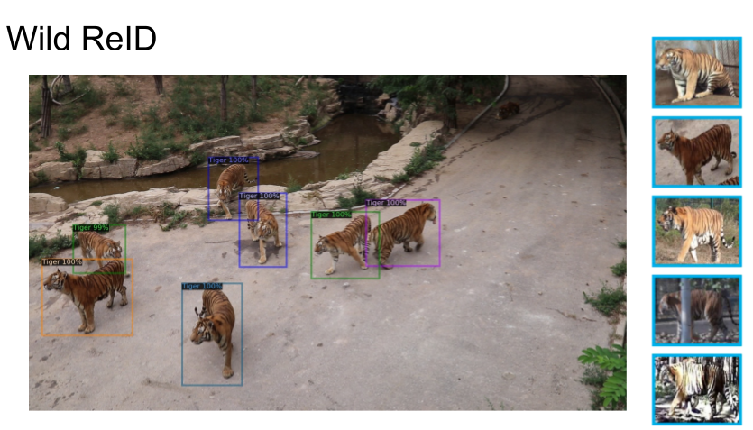

## Tiger ReID
Code for challenge track of Computer Vision for Wildlife Conservation (CVWC) part of ICCV 2019



#### Code Structure
```bash
.
├── detection               # Code and scripts for object detection (for tigers) using detectron2
├── re-id                   # Code for training re-id model (deep metric learning)
└── README.md
```

#### Requirements
- Detectron2 for object detection
- Tensorflow for ReID
- `pip install -r requirements.txt`


#### Detector
- Download the dataset from the official [source](https://cvwc2019.github.io/challenge.html)
- We finetune using [detectron2](https://github.com/facebookresearch/detectron2) and use `tigerCrop.py` script to extract bounding boxes of detected tigers

#### Re-ID
Use the `scripts/sub` file inside the `re-id/metric/hdc_k` folder to run the training and evaluation. Change the `PHASE` variable to change between training, validation and testing phase.
```
$ ./sub
```
